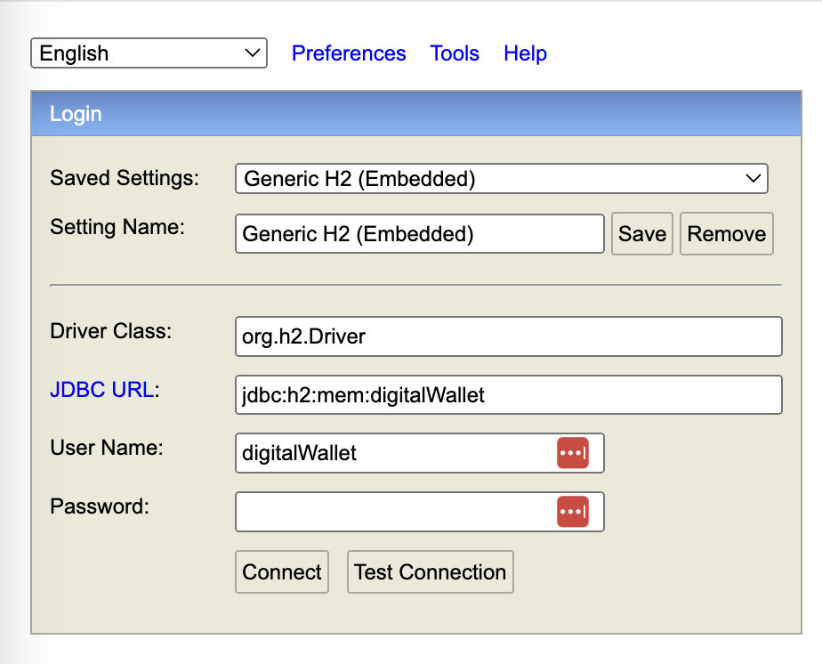

# Digital Wallet

This application was generated using JHipster 8.1.0, you can find documentation and help at [https://www.jhipster.tech/documentation-archive/v8.1.0](https://www.jhipster.tech/documentation-archive/v8.1.0).

## Setup and configuration

### Prerequisites

In order to build the server, you will need:

- [Java JDK](https://www.oracle.com/java/) >= 17
- [Apache Maven](http://maven.apache.org/) >= 3.8.5

Optional (see below):

- [Docker](https://www.docker.com/) (required for running tests with Postgresql locally).

### Development

To start your application in the dev profile, run:

```
./mvnw
```

**H2** in-memory database is used for development/with dev profile (activate by default).

### Testing

To launch your application's tests (unit and integration/functional tests), run:

```
./mvnw verify
```

To verify tests are passing with Postgresql, run with `prod` profile:

```
./mvnw verify -Pprod
```

### h2 console

You can connect to http://localhost:8080/h2-console:



## Application and service explanations

Reader can focus on the following classes:

- `DigitalWalletService` which is the interface declaring the contract/api to perform the following
  operations: deposit/withdrawal/view transactions
- `DigitalWalletServiceInternal` implementation that contains logic around all the above operations
  and persists when required in the database the changes (cf. `WalletAccountRepository`, `WalletTransactionRepository`).
- `SafeDigitalWalletService` an other implementation of `DigitalWalletService` that delegates every call to the actual
  and effective implementation (`DigitalWalletServiceInternal`) but that provides when necessary checks to prevent from
- executing concurrent requests simultaneously for the same customer. It is done by using a striped lock from Google
  guava library to allow independent operations (deposit & withdrawal for two different customers are independent) to
  lock different stripes and proceed concurrently while avoiding contention as mush as possible (it is not using a global lock)
- `WalletAccountRepository` and `WalletAccount` are respectively the Spring Data JPA repository and the entity representing
  wallet account.
- `WalletTransactionRepository` and `WalletTransaction` are respectively the Spring Data JPA repository and the entity representing
  wallet transaction.

`DigitalWalletServiceIntTest` shows to the reader examples of service usage and proves it actually works! It focuses
primarily on integration/functional level tests by testing different real world scenarios such as: normal deposit/withdrawal
(within the lower and upper bounds), deposit/withdrawal outside lower and upper bounds, withdrawal with insufficient balance,
unknown customer...

The application uses [Liquibase](https://www.liquibase.org/) to track, version, and deploy database changes (not relevant for this exercise though).
See `src/main/resources/config/liquibase/*`.

### Limitations

The data model is relatively (very) simple and would be more complex in real world application. Customer information is
not stored anywhere. We could have introduced another table linked to the `wallet_account` one that would contain customer
metadata.
